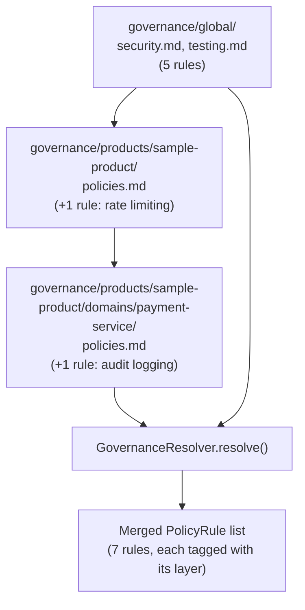
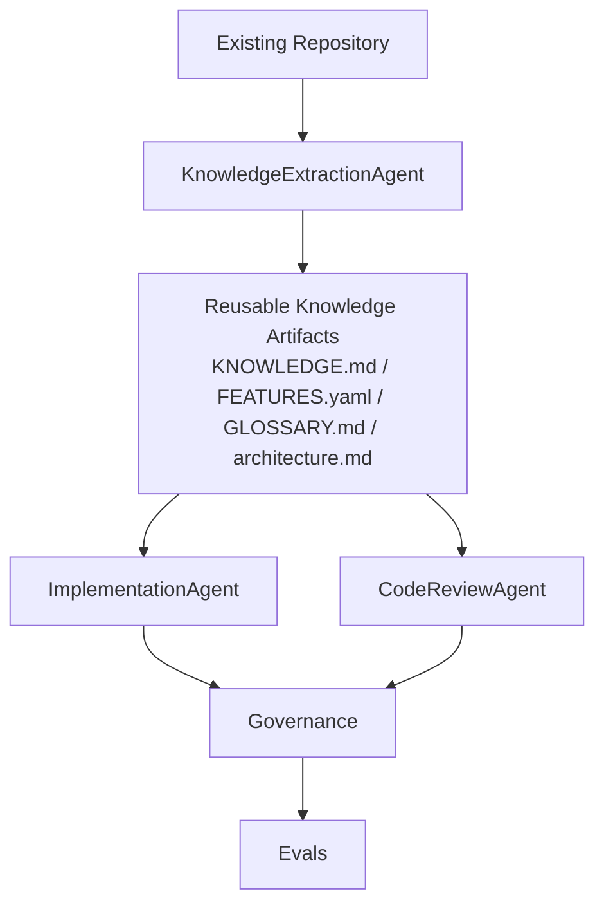

# agentic-ai-development-governance-platform

A demonstration platform for governing AI-agent-driven software
development: layered governance (global → product → domain) that
**extends, never relaxes**; a knowledge-extraction agent that turns an
existing codebase into reusable, evidence-backed context instead of
making every agent rediscover it; agents that draft specs,
implementations, and reviews using both; skills that document what each
agent does and how it's judged; and a workflow that carries a feature
request through a QC gate and a human approval checkpoint, with full
traceability from request to shipped code.

This is a standalone demonstration project. It is not affiliated with,
and does not contain any code, prompts, policies, or architecture from,
any employer. All governance documents, products, domains, and examples
are fictional, written for this repository.

**Scope note:** this demonstrates the architectural ideas -- layered
governance with real enforcement, evidence-grounded knowledge extraction,
a governed multi-stage workflow, a QC gate, human approval, skill/
workflow evals -- at a scale a reader can actually inspect: one product,
one domain, one sample application, seven agents, six skills. It does not
attempt 20+ agents, a vector database / RAG pipeline, or multi-repository
orchestration; see [Future improvements](#future-improvements) for why
that's a deliberate choice, not a gap.

## What this demonstrates

- **Layered governance with real enforcement.** Global rules apply
  everywhere; a product layer and a domain layer can each add stricter
  rules on top. A lower layer that tries to weaken an inherited rule
  raises `GovernanceViolationError` -- this is checked in code
  (`src/governance/resolver.py`), not just asserted in a docstring.
- **A governed, multi-stage workflow**, not just a single review step:
  feature request → tech spec → implementation → review → QC gate
  (with a bounded remediation loop) → human approval → traceability
  report.
- **AI evaluation, not just AI generation.** Every check produces a typed
  result (`PASS`/`FAIL`/`WARNING`) with severity, evidence, an
  explanation, and a confidence score. Deterministic AST checks are
  ground truth wherever one exists; the model is never allowed to
  overrule a deterministic finding, only to explain it.
- **Evidence-grounded knowledge extraction**, kept conceptually distinct
  from governance: policy answers "what rules must the system obey?",
  knowledge answers "what do I need to know about *this* codebase to
  work in it correctly?" `KnowledgeExtractionAgent` computes structural
  facts (components, dependencies, features) deterministically -- the
  model never touches them -- and only writes prose (findings, glossary,
  architecture overview) over pre-selected context, with every citation
  checked against the real file list afterward.
- **Governance, knowledge, skills, agents, and workflows as separate
  concepts**, each with their own home in the repo (`governance/`,
  `knowledge/`, `skills/`, `src/agents/`, `workflows/`) instead of one
  file doing all five jobs.
- **Convention-aware code review that doesn't blur policy and style.**
  `CodeReviewAgent.check_conventions()` compares code against a
  repository convention knowledge extraction discovered (e.g. "handlers
  call `require_authorization()`") and reports `FOLLOWED`/`DEVIATION` --
  a separate model from policy's `PASS`/`FAIL`, so a convention deviation
  can never be silently treated as a policy failure.
- **Skill, workflow, and knowledge evals**, distinct from unit tests: "did
  `code-review` detect the known violation?", "did `create-tech-spec`
  include every required section?", "does the workflow converge FAIL →
  remediate → PASS the way the demo claims?", "does knowledge extraction
  ever claim a dependency (e.g. Redis) that was never actually imported?"
  -- run against the real bundled governance and examples, not synthetic
  fixtures.

## Three demos

| | `knowledge-extract` | `review` | `feature` |
|---|---|---|---|
| What it is | Analyze an existing repo, write reusable knowledge artifacts | Ad-hoc: one file against one policy document (+ optional conventions) | The governed workflow: request → spec → code → review → QC gate → approval |
| Input | `examples/sample-product/` | A single flat policy file (`policies/`) + optional `knowledge/` | Layered governance: global → product → domain (`governance/`) |
| Run it | `python -m src.main knowledge-extract --repo examples/sample-product` | `python -m src.main review --policy policies/sample_engineering_policy.md --knowledge knowledge/ --code examples/sample-product/api/keys.py` | `python -m src.main feature --approve` |

All three are fully offline by default (`--provider fake`); all accept
`--provider anthropic` for real model calls.

## Architecture: five concepts, five homes

```
governance/     WHAT must be true          (constitutions -- non-negotiable)
knowledge/      WHAT this codebase already does (extracted facts + conventions, evidence-backed)
skills/         HOW an agent does a task    (procedure + inputs/outputs + eval criteria)
src/agents/     WHO executes a skill        (the actual code)
workflows/      WHEN things happen, in what order, with what gates
```

Or, as the distinction that motivated splitting `knowledge/` out from
`governance/` in the first place:

```
Constitution / Policy   "What rules must I obey?"
Knowledge                "What do I need to know about this system?"
Skill                     "How do I perform this task?"
Agent                     "Who performs the task?"
Workflow                  "When and in what order does the work happen?"
```

A rule in `governance/` is enforced the same way regardless of which
agent or skill touches it. A skill in `skills/*/SKILL.md` documents what
`code-review` (say) is supposed to do; `src/agents/code_reviewer.py` is
what actually does it. `workflows/feature-development.yaml` isn't
decorative -- `src/main.py`'s `feature` subcommand reads its gate config
(remediation attempts, whether human approval is required) rather than
hardcoding it. `knowledge/` isn't decorative either -- `review
--knowledge` loads its `knowledge.json` and `CodeReviewAgent` actually
checks code against it (see [Knowledge Extraction](#knowledge-extraction)
below).

## Layered governance



Each layer only **adds** rules -- `GovernanceResolver` concatenates
global + product + domain and prefixes each rule's id with its layer
(`GLOBAL-001`, `PRODUCT-SAMPLE-PRODUCT-001`, `DOMAIN-PAYMENT-SERVICE-001`)
so the resolved list stays traceable to where each rule came from. Before
merging a non-global layer, the resolver scans its raw text for
relaxation markers ("is exempt", "is waived", "override:", ...) and
raises `GovernanceViolationError` if it finds one -- a product or domain
document cannot talk its way out of an inherited rule. See
`governance/global/agent-governance.md` for the principle this encodes
and `tests/test_governance_resolver.py` for the enforcement tests.

The bundled example mirrors a real scenario: global security/testing
rules apply everywhere; `sample-product` adds a rate-limiting rule; its
`payment-service` domain adds the strictest rule of all -- privileged
operations must be audit-logged -- which global and product never would
have caught on their own.

## The feature-development workflow

```mermaid
flowchart TD
    FR[Feature request] --> TS[TechSpecAgent\n/create-tech-spec]
    Rules[Resolved governance rules] --> TS
    TS --> Spec[TechSpec]
    Spec --> IM[ImplementationAgent\n/implement]
    IM --> Code[Draft code]
    Code --> CR[CodeReviewAgent\n/code-review]
    Rules --> CR
    CR --> Report[EvaluationReport]
    Report --> QC{QC Gate}
    QC -- FAIL, attempts left --> RM[ImplementationAgent\n/implement remediate]
    RM --> CR
    QC -- FAIL, exhausted --> Block[BLOCK]
    QC -- PASS --> HA{Human approval}
    HA -- --approve --> Approved[APPROVED]
    HA -- not yet --> Pending[PENDING]
    Approved --> Trace[Traceability report]
    Pending --> Trace
```

Run it against the bundled example -- "add an admin endpoint to rotate a
service account's API key" -- and it plays out exactly like this:

1. **Tech spec**: `TechSpecAgent` resolves 7 governance rules (5 global +
   1 product + 1 domain) and produces a spec with every rule traced into
   Requirements, Security Considerations, or Test Plan.
2. **Draft implementation**: `ImplementationAgent` produces a first draft
   (`examples/sample-feature/fixtures/draft_implementation.py` in offline
   mode) that satisfies authorization, input validation, secrets, and SQL
   safety -- but misses the domain-specific audit-logging rule.
3. **Review + QC gate, attempt 0**: `CodeReviewAgent` finds exactly one
   `FAIL`: `DOMAIN-PAYMENT-SERVICE-001`. The QC gate returns `FAIL`; one
   remediation attempt remains, so the workflow doesn't stop here.
4. **Remediation**: `ImplementationAgent.remediate()` regenerates the file
   given that specific violation (not a patch -- a full new draft; see
   [tradeoffs](#design-decisions-and-tradeoffs)).
5. **Review, attempt 1**: 0 fails, 1 warning (the rate-limiting rule has
   no deterministic checker -- see [evaluation](#how-evaluation-works)).
   QC gate: `PASS`.
6. **Human approval**: with `--approve`, `APPROVED`; without it, `PENDING`
   -- the workflow halts at the checkpoint rather than assuming consent.
7. **Traceability report**: every governance rule applied, the full
   remediation history, and the final QC/approval outcome, all tagged
   with the feature id.

```bash
python -m src.main feature --approve
# or, to see the halt-at-approval behavior:
python -m src.main feature
```

`examples/sample-feature/` holds the request, the offline-demo fixtures,
and a real generated tech spec / final source / traceability report
(produced by running `--save-artifacts examples/sample-feature`, not
hand-written).

## Knowledge Extraction

Knowledge extraction turns information hidden in an existing codebase
into reusable context for AI agents. Instead of requiring every agent to
rediscover the architecture, conventions, dependencies, and feature
behavior on every run, the system generates evidence-backed knowledge
artifacts that later agents can selectively consume.



`examples/sample-product/` is a small, fictional application (`api/` →
`auth/` → `services/` → `models/`, plus `tests/`) built specifically to
give the extractor real relationships to find: two endpoints
(`rotate_api_key`, a privileged action; `get_user`, read-only, for
contrast), each spanning a route, an authorization check, a service, a
model, and a test file.

```bash
python -m src.main knowledge-extract --repo examples/sample-product
```

This prints components discovered, features discovered (with their
entry points/dependencies/tests), external dependencies, an architecture
observation, an evidence-backed-findings count, and any uncertain
findings flagged for human review -- then writes `KNOWLEDGE.md`,
`FEATURES.yaml`, `GLOSSARY.md`, `architecture.md`, and a `knowledge.json`
sidecar into `knowledge/`.

### Reliability: structural facts are computed, not asked for

`KnowledgeExtractionAgent` (`src/agents/knowledge_extractor.py`) never
asks the model "what are this repo's dependencies/features?" --
`src/knowledge/context.py` computes those with `ast`, and
`external_dependencies`, `Feature.dependencies`, and `Feature.tests` are
built from the real import graph. There is no code path by which a
Redis-shaped hallucination could reach `FEATURES.yaml`. The model (real
or fake, via the same `KNOWLEDGE_SYNTHESIS` task and the same
`select_context()` payload) is used only for the genuinely interpretive
part -- findings, glossary definitions, an architecture overview -- and
every evidence citation it returns is checked against the real file list
afterward. A citation to a file that doesn't exist is dropped; a finding
that loses all its evidence that way is kept but marked
`uncertain=True` at low confidence rather than presented as fact; a
glossary term with no valid evidence is dropped outright. See
`evaluations/knowledge_evals/` for this tested directly (known-fact
extraction, cross-file dependency reconstruction, the Redis
never-claimed case, and a domain glossary term with correct evidence).

### Context selection, not a RAG pipeline

Before any model call, `select_context()` (`src/knowledge/selection.py`)
sends structured summaries for every file (already compact -- names,
docstrings, calls, not raw text) plus short source excerpts for a small,
scored subset of the most relevant files (files with routes, files other
files depend on, files in `auth/`). No embeddings, no vector search, no
retrieval framework -- a repo this size doesn't need one, and "keep it
understandable" was an explicit constraint on this feature.

### Policy vs. convention: `review --knowledge`

```bash
python -m src.main review --policy policies/sample_engineering_policy.md \
                           --knowledge knowledge/ \
                           --code examples/sample-product/api/keys.py
```

`CodeReviewAgent.check_conventions()` finds the authorization convention
knowledge extraction discovered (calling `require_authorization()`) and
checks handler-shaped functions in the reviewed file against it,
returning `FOLLOWED`/`DEVIATION` -- never a policy `FAIL`. Run against
`api/keys.py` it reports `FOLLOWED`; run against `api/users.py` (a
legitimate read-only exception to the pattern) it reports `DEVIATION`,
with a note that this may be intentional. That's the point: a deviation
is a flag for a human to look at, not an automatic policy violation --
only an actual `PolicyRule` with its own checker can produce a `FAIL`.

## Agents and skills

| Skill (`skills/*/SKILL.md`) | Agent (`src/agents/`) | Job |
|---|---|---|
| `extract-policy` | `PolicyExtractorAgent` | Prose governance → structured `PolicyRule` list |
| `create-tech-spec` | `TechSpecAgent` | Feature request + rules → `TechSpec` with every rule traced |
| `implement` | `ImplementationAgent` | Spec → code; violations → regenerated code |
| `code-review` | `CodeReviewAgent` | Code + rules (+ optional knowledge) → typed PASS/FAIL/WARNING results (+ convention notes) |
| `fix` | `FixAgent` | FAIL results → suggested (not auto-applied) snippets |
| `knowledge-extraction` | `KnowledgeExtractionAgent` | Repository → `KnowledgeReport` + KNOWLEDGE.md/FEATURES.yaml/GLOSSARY.md/architecture.md |

`EvaluationAgent` and `QCGate` round out the pipeline (packaging a review
into a report, and turning a report into a PASS/FAIL/BLOCK decision) but
don't have their own SKILL.md -- they're mechanism, not a task an agent
"performs" the way drafting a spec or reviewing code is.

## How evaluation works

Every rule produces an `EvaluationResult`: `rule_id`, `description`,
`severity`, `status`, `evidence`, `explanation`, `confidence` (0.0-1.0),
and `method` (`DETERMINISTIC`/`LLM`/`HYBRID`).

This project ships small AST-based checkers (`src/agents/checks.py`) for
six categories: hardcoded secrets, string-built SQL, missing
authorization, missing input validation, missing error handling, and
missing audit logging. When a rule's category matches one of those, the
checker's PASS/FAIL verdict is **ground truth** -- the model only writes
the explanation (`method = HYBRID`). When no checker matches, the system
falls back to a full model judgment (`method = LLM`), and a `PASS`
reported with confidence below 0.75 is downgraded to `WARNING` rather
than trusted outright.

The default `--provider fake` client is a scripted, fully offline
stand-in -- real (if simple) markdown parsing for rule extraction, real
templated judgments for review/fix/tech-spec, and pre-written fixtures
for implementation/remediation (writing working code from a spec is well
beyond what a heuristic can honestly fake). `--provider anthropic` swaps
in real generation everywhere.

## Evaluations vs. tests

- `tests/` -- fast, isolated unit tests against small synthetic fixtures.
  Run by default: `pytest`.
- `evaluations/` -- behavioral evals against the real bundled
  `governance/`, `policies/`, and `examples/` content, organized the way
  the brief asked: `policy_evals/`, `skill_evals/`, `workflow_evals/`,
  `knowledge_evals/`. These answer questions like *"did `code-review`
  detect the known violation?"*, *"does the workflow converge exactly the
  way the demo claims?"*, and *"does knowledge extraction ever claim a
  dependency that was never imported?"* -- and the workflow eval loads
  its gate config from the real `workflows/feature-development.yaml`, so
  it also catches a broken config-wiring path a unit test constructing
  objects directly would miss. Run separately: `pytest evaluations/`.

## How to install and run

```bash
git clone <this repo>
cd agentic-ai-development-governance-platform
python -m venv .venv && source .venv/bin/activate
pip install -r requirements.txt

# Ad-hoc review, offline, no API key needed:
python -m src.main review --policy policies/sample_engineering_policy.md \
                           --code examples/violating_code.py \
                           --reference examples/compliant_code.py

# Governed feature workflow, offline, no API key needed:
python -m src.main feature --approve

# Knowledge extraction, offline, no API key needed:
python -m src.main knowledge-extract --repo examples/sample-product
python -m src.main review --policy policies/sample_engineering_policy.md \
                           --knowledge knowledge/ \
                           --code examples/sample-product/api/keys.py

# With a real model (optional, any subcommand):
cp .env.example .env   # add your ANTHROPIC_API_KEY
python -m src.main feature --approve --provider anthropic

# Unit tests (fast, offline):
pytest
# Evaluations (offline, run against real bundled content):
pytest evaluations/
```

## Design decisions and tradeoffs

- **Deterministic-first, model-for-prose.** For every category this
  project can check mechanically, the checker's verdict is authoritative
  and the model only writes the explanation. The cost is coverage -- a
  new category needs a new checker to get this guarantee, or it falls
  back to pure model judgment (and gets flagged as low-confidence rather
  than trusted).
- **Regeneration, not patching, for remediation.** `ImplementationAgent.
  remediate()` asks for a whole new file given the specific violations,
  rather than trying to auto-patch the previous one. This is both a more
  realistic pattern for how coding agents actually respond to review
  feedback and it sidesteps the much harder, separate problem of reliably
  patching a file in place -- which is also why `FixAgent`'s suggestions
  are never auto-applied (they're advisory, for a human or for the
  `implement` skill's own remediation call to act on).
- **A bounded remediation loop, not an unbounded one.**
  `max_remediation_attempts` (configured in
  `workflows/feature-development.yaml`, overridable on the CLI) turns a
  persistently-failing implementation into `BLOCK` rather than looping
  forever. Unglamorous, but a real safeguard, not a placeholder.
- **The relaxation check is a small, explicit heuristic, not a general
  verifier.** `GovernanceResolver` scans for a short list of phrases
  ("is exempt", "override:", ...) rather than semantically diffing rule
  text across layers. It catches the obvious case (a lower layer plainly
  saying a rule doesn't apply) and documents the pattern; a production
  system would need something closer to a real policy-diff engine.
  See [Future improvements](#future-improvements).
- **`FakeLLMClient` fixtures, not fake intelligence, for code generation.**
  Rule extraction and review/fix explanations have honest, if simple,
  offline logic. Writing an implementation from a spec doesn't have an
  honest heuristic equivalent, so the offline path uses pre-written
  fixtures and raises `NotImplementedError` if none is configured, rather
  than pretending to generate code it isn't generating.
- **A YAML workflow file that's actually load-bearing.**
  `workflows/feature-development.yaml`'s gate config is read by
  `src/main.py`, not just described by it -- changing the file changes
  the CLI's behavior (see `evaluations/workflow_evals/`, which loads it
  the same way to catch a broken wiring path a direct-construction unit
  test would miss).
- **No agent framework.** Every orchestrator (`Orchestrator`,
  `FeatureWorkflow`) is a plain class calling plain agent methods in
  sequence; `KnowledgeExtractionAgent` doesn't need one at all -- it's a
  single agent, not a pipeline. At seven agents and two linear pipelines,
  a framework would add indirection without adding capability -- the
  value of separate agent classes is that each is independently
  testable, not that they need a
  message bus to talk to each other.
- **One real provider, wired through a two-method protocol.** `LLMClient`
  is `complete(system, user) -> str`. Adding OpenAI or another provider
  is a new class implementing that protocol, not a refactor.
- **Structural knowledge facts are computed, never asked for.**
  Components, the import graph, `external_dependencies`, and
  `Feature.dependencies`/`.tests` come from `ast` analysis in
  `src/knowledge/context.py`, not from a model call. Only the
  interpretive layer (findings, glossary, architecture prose) goes
  through the model, and even that gets every citation checked against
  the real file list afterward. This is the same deterministic-first
  philosophy as policy checking, applied one layer earlier.
- **`FakeLLMClient`'s knowledge-synthesis heuristic reads the same
  payload a real model would, not a shortcut.** It derives the
  authorization marker, validation examples, test mapping, and feature
  chains from the `select_context()` JSON itself (via `calls`/`raises`
  per function), rather than being handed pre-computed facts under
  different field names. This does mean `FakeLLMClient` and
  `KnowledgeExtractionAgent`'s own chain-building duplicate a small
  amount of graph-walking logic -- unavoidable given `LLMClient`
  implementations only ever exchange JSON text, never Python objects, and
  not a divergence risk since both walk the same underlying import graph.
- **Convention deviations are a different model, not a softer status.**
  `ConventionObservation` (`FOLLOWED`/`DEVIATION`) is deliberately not
  `EvaluationResult` with an extra status value -- reusing that model
  would let a caller accidentally treat a style deviation as a policy
  `FAIL` just by pattern-matching on shape. `check_conventions()` is also
  a separate method from `review()`, never called implicitly, so
  existing policy-review behavior is unchanged whether or not knowledge
  is available.

## Future improvements

Roughly the order this project would grow in, if it kept going:

1. **Real policy-diff enforcement.** Replace the relaxation-marker
   heuristic with something that actually diffs rule semantics across
   layers, so a lower layer can't quietly redefine a rule's meaning
   without tripping an obvious keyword.
2. **Report every violating instance per rule**, not just the first.
3. **A second real provider** behind `LLMClient`, to prove the
   abstraction rather than assert it.
4. **More deterministic checkers** (the rate-limiting category has none
   in this demo, so it's always a `WARNING` in offline mode).
5. **Structured JSON/HTML report output** alongside the CLI text report.
6. **Multi-repository / multi-product support as a later enhancement,
   deliberately last.** The layering model (`GovernanceResolver` +
   `load_layers`) already generalizes to more products and domains
   without a redesign; what it doesn't have is the org-level machinery
   (a repo registry, cross-repo delivery coordination) that a real
   multi-repo rollout needs. Adding that before the single-product
   story was solid would have been scale for its own sake.
7. **More convention categories.** `check_conventions()` currently checks
   one pattern (authorization). Validation and error-handling
   conventions would follow the same shape -- find a marker
   deterministically, check handler-shaped functions against it -- but
   adding them wasn't needed to demonstrate the mechanism.
8. **Incremental / scoped knowledge extraction.** Today each run
   re-analyzes the whole repository from scratch. A `--module` scope
   filter and merging into an existing `knowledge.json` (instead of
   overwriting it) would matter for a repo too large to fully
   re-summarize on every run; out of scope for a demo-sized codebase.

## Project layout

```
agentic-ai-development-governance-platform/
├── governance/                          # WHAT must be true
│   ├── global/
│   │   ├── security.md                  # 3 rules: secrets, SQL, authorization
│   │   ├── testing.md                   # 2 rules: input validation, error handling
│   │   └── agent-governance.md          # principles (not machine-checked rules)
│   └── products/sample-product/
│       ├── product.yaml                 # identity, default approver, domains
│       ├── policies.md                  # +1 rule: rate limiting
│       └── domains/payment-service/
│           └── policies.md              # +1 rule: audit logging (strictest layer)
│
├── knowledge/                           # WHAT this codebase already does (generated)
│   ├── KNOWLEDGE.md                     # findings: auth pattern, test org, ...
│   ├── FEATURES.yaml                    # structured feature inventory
│   ├── GLOSSARY.md                      # domain terms, evidence-backed
│   ├── architecture.md                  # overview + flows + Mermaid diagram
│   └── knowledge.json                   # machine-readable (loaded by `review --knowledge`)
│
├── skills/                              # HOW an agent does a task
│   ├── extract-policy/SKILL.md
│   ├── create-tech-spec/SKILL.md
│   ├── implement/SKILL.md
│   ├── code-review/SKILL.md
│   ├── fix/SKILL.md
│   └── knowledge-extraction/SKILL.md
│
├── workflows/
│   └── feature-development.yaml         # step order + gate config (load-bearing)
│
├── src/                                 # WHO executes a skill
│   ├── agents/                          # PolicyExtractorAgent, TechSpecAgent,
│   │                                       ImplementationAgent, CodeReviewAgent
│   │                                       (+ check_conventions), FixAgent,
│   │                                       KnowledgeExtractionAgent, checks.py
│   ├── governance/                      # loader.py + resolver.py (layer merge
│   │                                       + extend-never-relax enforcement)
│   ├── knowledge/                       # context.py (ast analysis), selection.py
│   │                                       (context-selection strategy), artifacts.py
│   │                                       (KNOWLEDGE.md/FEATURES.yaml/... renderers)
│   ├── models/                          # Pydantic models (policy.py, workflow.py,
│   │                                       knowledge.py)
│   ├── orchestration/                   # Orchestrator, FeatureWorkflow, QCGate
│   ├── llm/                             # LLMClient protocol, Anthropic + Fake
│   └── main.py                          # CLI: `review`, `feature`, `knowledge-extract`
│
├── policies/                            # flat policy doc for the `review` demo
├── examples/
│   ├── violating_code.py / compliant_code.py   # `review` demo fixtures
│   ├── sample-feature/                          # `feature` demo fixtures + real
│   │   ├── feature-request.md                    output (tech spec, source,
│   │   ├── fixtures/                              traceability report)
│   │   ├── generated-tech-spec.md
│   │   ├── source/
│   │   └── traceability-report.md
│   └── sample-product/                          # `knowledge-extract` demo repo
│       ├── api/ auth/ services/ models/ tests/    (rotate_api_key + get_user)
│       └── README.md
│
├── tests/                               # unit tests (pytest, default)
└── evaluations/                         # policy_evals, skill_evals, workflow_evals,
                                            knowledge_evals (pytest evaluations/)
```
