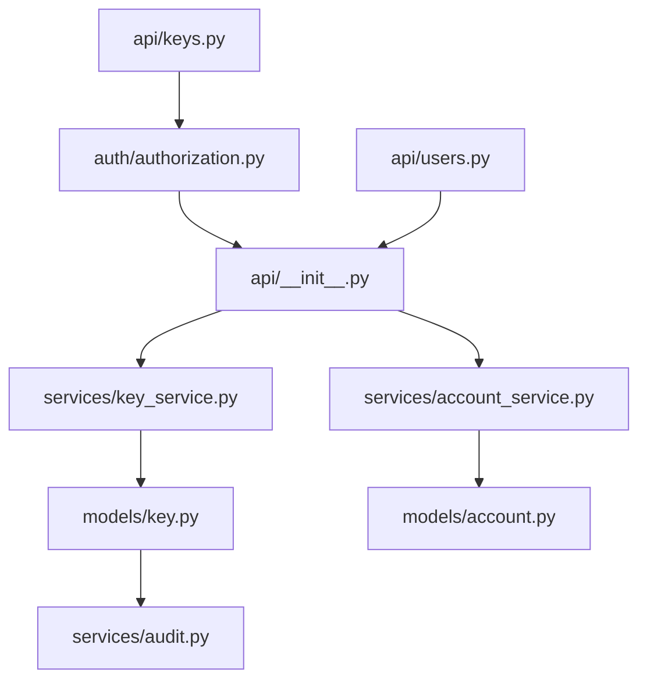

# architecture.md

The system is organized into api, auth, models, services, tests. A request enters through api/keys.py and flows through api/__init__.py -> auth/authorization.py -> services/key_service.py -> models/key.py -> services/audit.py.

## Flows

### POST /admin/accounts/{account_id}/keys/rotate

1. POST /admin/accounts/{account_id}/keys/rotate -> api/keys.py:rotate_api_key()
   -> auth/authorization.py
   -> api/__init__.py
   -> services/key_service.py
   -> models/key.py
   -> services/audit.py

### GET /accounts/{account_id}

1. GET /accounts/{account_id} -> api/users.py:get_user()
   -> api/__init__.py
   -> services/account_service.py
   -> models/account.py

## Diagram

